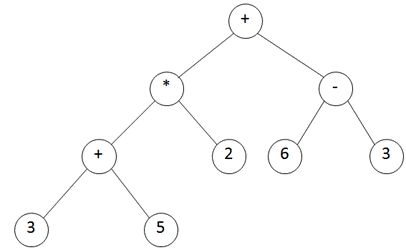

# マクロ入門

---

今回はマクロをサラッと説明するだけ

---

### メタプログラミング

ロジックを生成する高位ロジックを作る

簡単に言うとプログラムを作るプログラム

* C#の式木
* Javaのリフレクション
* HaskellのQモナド

---

### メタプログラミング

ruby

```ruby
{cat: 'Meow', dog: 'Bowow'}.each do |name, message|
  define_method(name) do
    puts message
  end
end
```

---

## マクロとは？

* メタプログラミングの一種
* AST(Abstract Syntax Tree: 抽象構文木)を構築することでプログラムを作る

---

メリット

* コンパイル時計算ができる
  * 外部からデータを読み込み、プログラムに反映させる
  * Elixirの実装自体でコンパイル時にユニコードのデータを読み込み、色々な関数を定義している
* 新たな構文を作ることができる
* インライン化

---

マクロのある言語

* Lisp系言語
* Elixir
* Nemerle

など

---

### AST

```
((3 + 5) * 2) + (6 - 3)
```



---

### AST

elixir

```
x = 1
y = 2
x + y
```

```
{:__block__, [],
  [
    {:=, [], [
      {:x, [], Elixir},
      1
    ]},
    {:=, [], [
      {:y, [], Elixir},
      2
    ]},
    {:+, [context: Elixir, import: Kernel], [
      {:x, [], Elixir},
      {:y, [], Elixir}
    ]}
  ]
}
```

---

# Elixirでマクロが使われているところ

---

# 突然ですがクイズです

---

Q. このコードにはいくつのマクロが使われている？

```elixir
defmodule Maybe do
  def fmap(value, func) do
    if is_nil(value) do
      nil
    else
      func.(value)
    end
  end
end
```

---

A. 4つ

* defmodule
* def
* if
* is_nil

---

## Ecto

キーワードクエリシンタックス

LINQっぽい書き方でクエリを構築できる

---

## Ecto

1番めの投稿の全てのコメント

code

```elixir
from c in Comment,
join: p in assoc(c, :post),
where: p.id == 1,
select: c
```

---

## Ecto

```elixir
ast = quote do ~~~~ end
Macro.expand(ast, __ENV__)
```

AST

```elixir
{:%{}, [],
 [__struct__: Ecto.Query, assocs: [], distinct: nil,
  from: {{{:., [], [Comment, :__schema__]}, [], [:source]}, Comment},
  group_bys: [], havings: [],
  joins: [{:%, [],
    [{:__aliases__, [alias: Ecto.Query.JoinExpr, counter: -576460752303423045],
      [:JoinExpr]},
     {:%{}, [],
      [qual: :inner, source: nil,
       on: {:%, [],
        [{:__aliases__, [alias: false, counter: -576460752303423045],
          [:Ecto, :Query, :QueryExpr]},
         {:%{}, [], [expr: true, params: [], line: 0, file: "iex"]}]},
       assoc: {0, :post}, file: "iex", line: 0, params: []]}]}], limit: nil,
  lock: nil, offset: nil, order_bys: [],
  prefix: {{:., [], [Comment, :__schema__]}, [], [:prefix]}, preloads: [],
  select: {:%, [],
   [{:__aliases__, [alias: false, counter: -576460752303423029],
     [:Ecto, :Query, :SelectExpr]},
    {:%{}, [],
     [expr: {:{}, [], [:&, [], [0]]}, params: [], file: "iex", line: 0,
      take: {:%{}, [], []}]}]}, sources: nil, updates: [],
  wheres: [{:%, [],
    [{:__aliases__, [alias: false, counter: -576460752303423037],
      [:Ecto, :Query, :QueryExpr]},
     {:%{}, [],
      [expr: {:{}, [],
        [:==, [],
         [{:{}, [],
           [{:{}, [], [:., [], [{:{}, [], [:&, [], [1]]}, :id]]}, [], []]},
          {:%, [],
           [Ecto.Query.Tagged, {:%{}, [], [value: 1, type: {1, :id}]}]}]]},
       params: [], file: "iex", line: 0]}]}]]}
```

---

### Ecto

マクロ展開後のコード

```elixir
ast = quote do ~~~~ end
Macro.expand(ast, __ENV__) |> Macro.to_string
```

```elixir
%{
  __struct__: Ecto.Query,
  assocs: [],
  distinct: nil,
  from: {Comment.__schema__(:source), Comment},
  group_bys: [],
  havings: [],
  joins: [%JoinExpr{qual: :inner, source: nil, on: %Ecto.Query.QueryExpr{expr: true, params: [], line: 0, file: \"iex\"}, assoc: {0, :post}, file: \"iex\", line: 0, params: []}],
  limit: nil,
  lock: nil,
  offset: nil,
  order_bys: [],
  prefix: Comment.__schema__(:prefix),
  preloads: [],
  select: %Ecto.Query.SelectExpr{expr: {:&, [], [0]}, params: [], file: \"iex\", line: 0, take: %{}},
  sources: nil,
  updates: [],
  wheres: [%Ecto.Query.QueryExpr{expr: {:==, [], [{{:., [], [{:&, [], [1]}, :id]}, [], []}, %Ecto.Query.Tagged{value: 1, type: {1, :id}}]}, params: [], file: \"iex\", line: 0}]
}
```

---

## Phoenix

* routerのHTTPメソッド
  * get, post, put, patch, delete, options, connect, trace, head
  * resources
* Model, Controller, Viewなどで必要なモジュールのインポート

---

# 簡単なマクロを作る

---

# is_nil

```elixir
defmacro is_nil(term) do
  quote do
    unquote(term) == nil
  end
end
```

---

## defmacro

* マクロ定義の宣言
* ASTが引数として渡される
* ASTを返さなければいけない

---

## quote

渡されたコードをASTに変換する

```elixir
quote do
  1 + 1
end
```

↓

```elixir
{:+, [context: Elixir, import: Kernel], [1, 1]}
```

---

## unquote

quote内にコードを埋め込む

---

## ifを作ってみる

---

```elixir
defmacro my_if(clause, do: x, else: y) do
  quote do
    case clause do
      nil   -> unquote(y)
      false -> unquote(y)
      _     -> unquote(x)
    end
  end
end
```

